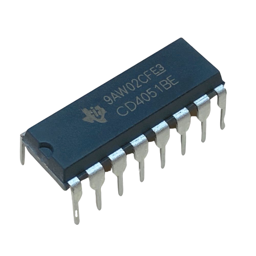

# Texas Instruments CD4051BE single 8-Channel multiplexer

### Quick recap

- The CD4051B is a single 8-Channel multiplexer having three
binary control inputs, A, B, and C, and an inhibit input. The
three binary signals select 1 of 8 channels to be turned on,
and connect one of the 8 inputs to the output. ([CD4051BE Datasheet p. 2](/datasheet/CD4051BE-Texas-Instruments.pdf))

- Basically  this means that the chip operates based on its own truth table, and works as a passthrough decoder. It receives A (Pin 11), B (Pin 10), C (Pin 9) and INHIBIT (Pin 6), which is always 0 and from it checks its own truth table and passes one of its inputs (IN/OUT Channels) to the COM OUT/IN (Pin 3). This pass can be made from both sides, allowing, for example, the passage of 5 Volts from COM OUT/IN to channel 0.

### Connections

- The chip required at least 3 Volts and has maximum operational VDD of 20 Volts (Pin 16)
- The chip requires only 1 nessesary ground connection VSS (Pin 9), and 1 unnessesary for INH (Pin 6). The reason to connect INH to the ground is because it is always 0 (from the [CD4051BE Datasheet p. 2](/datasheet/CD4051BE-Texas-Instruments.pdf) "When
a logic “1” is present at the inhibit input terminal, all
channels are off.") and this frees up an additional pin on the microcontroller board.
- A (Pin 11), B (Pin 10), C (Pin 9) must be connected to digital pins on the board.
- Channels (Chronologically pins 13,14,15,12,1,5,2,4) are measured from 0 to 7 and can either be connected or left unconnected to anything, (e.g. connected to the temperature sensore output).
- COM OUT/IN (Pin 3) must be connected to Analog input (e.g. A0, A1) on stm32.

### Truth Table ([CD4051BE Datasheet p. 5](/datasheet/CD4051BE-Texas-Instruments.pdf))

### Pinout ([CD4051BE Datasheet p. 3](/datasheet/CD4051BE-Texas-Instruments.pdf))

### Chip

