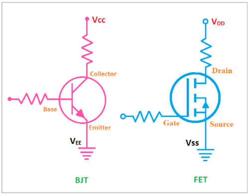
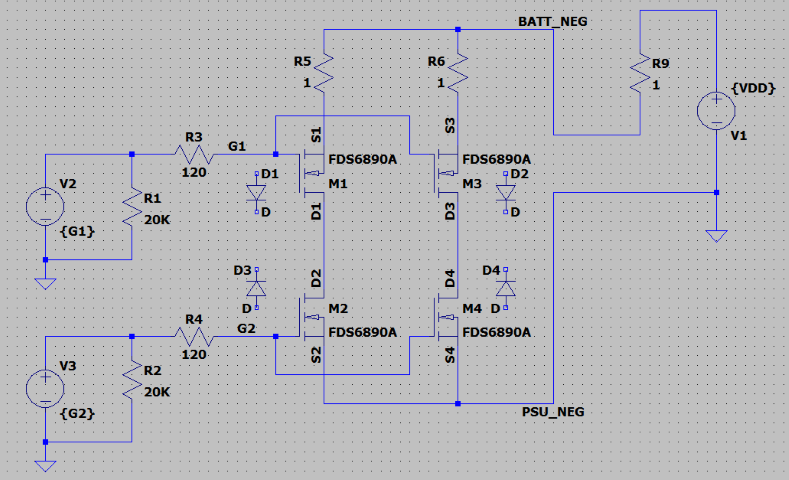

# Mosfet Power Control

## Mosfet Basics

### Types

The **metal-oxide-semiconductor field-effect transistor** ( **MOSFET** ,  **MOS-FET** , or  **MOS FET** ) is a type of [field-effect transistor](https://en.wikipedia.org/wiki/Field-effect_transistor "Field-effect transistor") (FET), is basically a digital switche controlled by it's gate. There are normally three terminals, Drain, Source and Gate. The gate controls the current flow through D-S or S-D. There are N-Channel mosfet, P-Channel mosfet. And there enhancement type and depletion type of each.

https://en.wikipedia.org/wiki/MOSFET

### Body diode

The existance of body diode in mosfet causing the current could flow to the forward direction of the body diode, even though the gate is off. 

# FDS6890A

FDS6890A is Dual N-channel mosfets in SO-8 package. With following characteristics.

## Terminology

https://woopcb.com/blog/what-is-vcc-vss-vdd-vee-in-electronics

## N-Channel Mosfets in series

N-Channel Mosfets in series offer extra control of the current due to in body diode. And puting mosfet-series-array in parrallel allow the mosfets to handle more current. In theory I_total_max = I_mosfet_max * N

Be aware, the physical diodes D1 and D2 were added only for demostration of in body diode of the N-Channel mosfet. There's no actual physical dioded added to the circuit.

The current control follows the following truth table.

| Gate 1 | Gate 2 | Current Direction | Charing | Discharging |
| ------ | ------ | ----------------- | ------- | ----------- |
| 0      | 0      | None              | NA      | NA          |
| 0      | 1      | Up to Bottom      | ON      | OFF         |
| 1      | 0      | Bottom to Up      | OFF     | ON          |
| 1      | 1      | Bidirectio        | ON      | ON          |

https://www.powerelectronictips.com/remember-mosfet-body-diode-faq/

## Control Logic In Practice

The maximum On state drain-source current and Off state drain-source diode forward current are 9.4A and 1.3A respectively. Therefore, we couldn't simply just allow the charging and discharging to occure without extra control.

- Start condition (0, 0)
- Discharging not allowed, charging allowed. (0, 1)
- Now the charging current ramps up --> also turn on the discharging MOSFET, say 1A. (1, 1)
- Charging drops below 1A, disable discharging MOSFET again to make sure we don't get to discharging. (0, 1)

--> keep in mind that
battery can either be charging or discharging, so if there is enough
power on the input (say solar) to power the load and charge battery,
nothing will come from the battery. If the load is higher than what
solar can provide, part of the required power comes from the battery.
