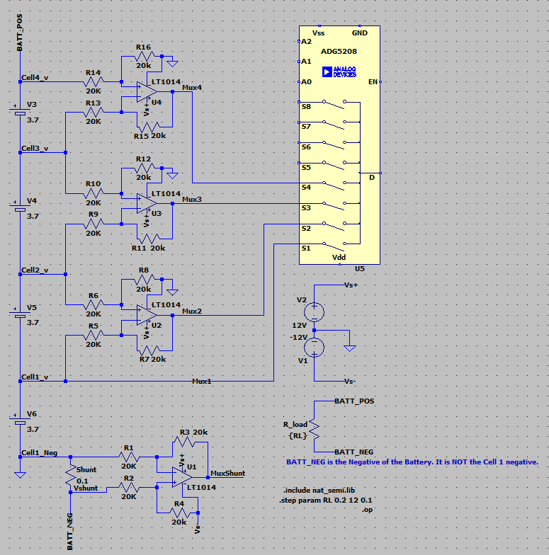

# Terminology

## Rail-To-Rail OPAMP

The power supply units of PCs and other devices incorporate multiple DC power supplies. A power supply line provided by a power supply unit is referred to as a power rail. The entire range from the maximum voltage of a power line (V ~CC~ ) to its minimum voltage (GND or minimum negative voltage, V ~EE~ ) is referred to as rail-to-rail.
"*Rail-to-rail* " is a marketing term used to describe an op amp whose dynamic range is able to reach the extremes of the supply voltage. This can refer to either the output or both the input and output.

https://toshiba.semicon-storage.com/ap-en/semiconductor/knowledge/faq/linear_opamp/what-does-rail-to-rail-mean.html

https://electronics.stackexchange.com/questions/224159/what-does-rail-to-rail-output-opamp-mean

## Electric Shunt

A **shunt** is a device that is designed to provide a low-resistance path for an electrical current in a circuit. There are many applications of an electric shunt, such as Defective device bypass, Photovoltaics, Lightning arrester and Current measuring.

### Current Measuring Shunt

Basically it is the technique to which uses a very small known resistor in series to the circuit to calculate the current by measuring the voltage difference between the resistor. There different positons such as High Side and Low Side. There can be circuit for Uni-direction current sensing and Bi-direction current sensing. In this project Bi-direction current sensing design was used, because of the current flow of the battery are bi-directional, charing and discharging.

https://www.analog.com/en/app-notes/an-105fa.html

### Differential Input Amplifier

As the name implies. 

Texas Instrument 00_opam_handbook.pdf P.24

## Multi Cell Battery Meter Circuit

