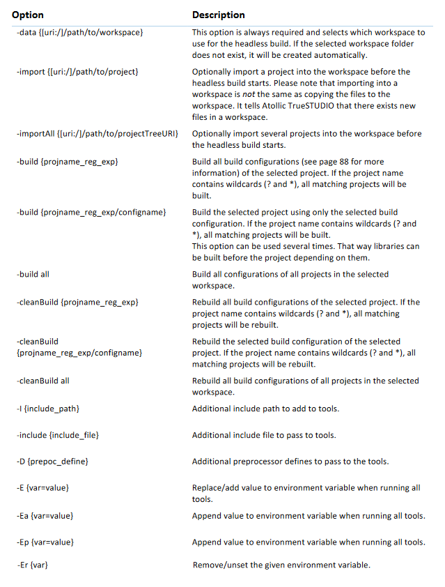

# Introduction

Atollic TrueSTUDIO is a C/C++ IDE for STM32 microcontroller and breakout boards. It is built on Eclipse ^®^ , CDT ^™^ , GCC and GDB, while it is easy to use the GUI for development, command line tools are available for CI/CD pipeline. As the time of writing this documentation, the version used was TrueSTUDIO 9.3.0.

HEADLESS BUILD

This is intended for Managed Mode projects that are to be integrated into script-
controlled builds, such as nightly builds on build servers for continuous integration process
methods, etc. It is possible to start a build process from the operating system command
line also for Managed Mode projects. The IDE GUI is never displayed in this case, and the
user does not have to interact manually with the IDE at all.
The IDE installation folder, e.g. C:\Program Files (x86)\Atollic\TrueSTUDIO for
STM32 9.0.0\ide, contains the file headless.bat, which is used for running
headless builds. 

atollic-truestudio-9.3.0 manual p. 110 - 116

# References

[TrueSTUDIO Installation Guide](https://www.st.com/resource/en/user_manual/truestudio_installation_guide-truestudio-installation-guide-stmicroelectronics.pdf)

[TrueSTUDIO Upgrade Guide](https://www.st.com/resource/en/user_manual/truestudio_upgradeguide-truestudio-upgrade-guide-stmicroelectronics.pdf)

[TrueSTUDIO UserManual 9.3.0](https://www.st.com/resource/en/user_manual/usermanual_truestudio-user-manual-for-truestudio-930-stmicroelectronics.pdf)
