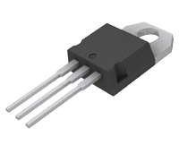
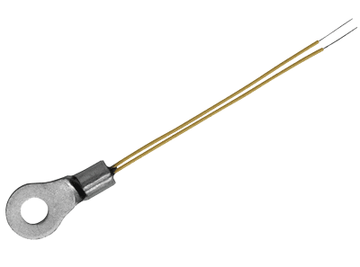
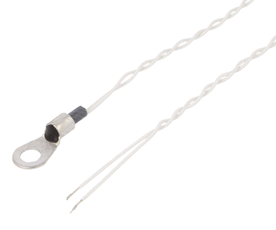
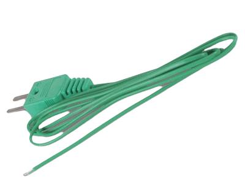

# Temperature Monitoring

# Thermocouple

### Quick Description

- A thermocouple is a sensor composed of two different types of metal joined together. While there are several types of thermocouples available, only K are practical for this project, so it will be covered.

### Thermocouple Type K

- Temperature Range: The temperature range of thermocouple type K varies depending on the specific model, but the average range typically spans from -40°C to +250°C.

### Usage with STM32

- To measure the temperature using an STM32 microcontroller, you will need a converter such as the MAX6675 chip. The MAX6675 is a K-Thermocouple-to-Digital Converter capable of handling cold-junction compensation and digitizing the signal from the K-Thermocouple. It provides a 12-bit resolution output signal (0.25 degrees resolution). The only disadvantage of that conversion is that it will not cover negative temperature, since the scope of a chip is from 0 to +1024 Degrees Celsius. See Reference for more information.

### Advantages

- Provides a wide range of temperature measurement.

# NTC Thermistor

### Quick Description

- A Negative Temperature Coefficient (NTC) thermistor is a sensor made of semiconductor material. Various variants of NTC thermistors are available, including those with a ring connector and fixed wire. NTC thermistors exhibit a non-linear resistance-temperature characteristic, which means their resistance changes rapidly over a relatively small temperature range. The typical temperature range for NTC thermistors is from -40°C to +100°C.

### Usage with STM32

- To measure an NTC thermistor, a simple voltage divider circuit can be constructed with a pull-down resistor. This allows the measurement of the thermistor's resistance, which can then be used to calculate the temperature using a formula that relates resistance to degrees Celsius.

### Advantages

- Cost-effective.
- Ease of Operation.

# RTD Sensor

### Quick description

- An Resistance Temperature Detector sensor is constructed from nearly pure platinum. RTDs can be available in various forms, including pure ceramic sensors, straight wire with a steel ending, and versions with ring connectors. For this project, we will focus on the PT100 and PT1000 RTDs, as they are the most common and readily available options.

### PT100 and PT1000

- PT100 and PT1000 sensors have different resistances and are not interchangeable. Both sensors exhibit a resistance of 100 ohms and 1000 ohms, respectively, at 0 degrees Celsius. This difference means that the PT1000 provides better accuracy due to its wider range of resistance values. However, it may be more challenging to find PT1000 sensors with wire connections.

### Usage with STM32

- To measure an RTD sensor, a voltage divider circuit (similar to NTC thermistor measurement) can be used to measure the voltage. This voltage can then be converted into resistance using the voltage divider formula and further converted into temperature using the resistance-to-temperature formula.

### Advantages

- Provides highly accurate and stable temperature measurements.
- Requires minimal calibration.

# IC Sensor

### Quick description

- Integrated Circuit Temperature Sensors are semiconductor devices primarily made of silicon. They provide the most linear output comparing to the rest sensors. The operation temperature is usually from -40 to +100 Celsius degrees.

### Usage with STM32

- To measure IC sensor it is as simple as just connecting it to the analog input of STM32 board, reading the values and applying formula to convert it to Celsius.

### Advantages

- Ease of Operation.
- Low Cost.
- Linearity.

# Which one to select?

1. **IC sensor** - The most preferred one because of ease of operation and linearity (~2 eur), but it might be not that accurate in operation (0.5°C Ensured Accuracy) and hard to mount.

LM35DT (TO220)

2. **NTC Thermistor** - Pretty accurate (±3%), not that expensive (~4 eur), and supports ring mount.

ALUG03-10K

3. **PT100/PT1000** - Very accurate (±0.3°C), a little bit expensive (~6 eur), might be harder to control, and supports a ring mount as well.

TT4M-PT100B-T125-M5-50

4. **Thermocouple** - Accurate (±0.4%), rarely expensive (~5-20 eur), has a big range of temperatures to measure, is hard to measure, and would be an overkill.

TP01

# References

### Thermocouple
- [Thermocouple probes](https://www.omega.com/en-us/resources/thermocouple-hub#:~:text=What%20is%20a%20thermocouple%3F,correlated%20back%20to%20the%20temperature.)
- [Working with STM32 and Sensors: Thermocouple TypeK](https://blog.embeddedexpert.io/?p=806)
- [MAX6675 Cold-Junction-Compensated K-Thermocouple](https://www.analog.com/media/en/technical-documentation/data-sheets/MAX6675.pdf)

### NTC Thermistor

- [What Is An NTC Thermistor](https://www.ametherm.com/thermistor/what-is-an-ntc-thermistor)
- [[For Arduino and STM32] Library for working with a NTC thermistor.](https://github.com/YuriiSalimov/NTC_Thermistor)

### RTD Sensor

- [Resistance thermometer](https://en.wikipedia.org/wiki/Resistance_thermometer)

### IC Sensor

- [IC Sensors](https://www.omega.com/en-us/resources/integrated-circuit-sensors)
- [STM32 Nucleo and LM35 temperature sensor](http://www.armlearning.com/code/mbed/stm32-nucleo-lm35-temperature-sensor.php)